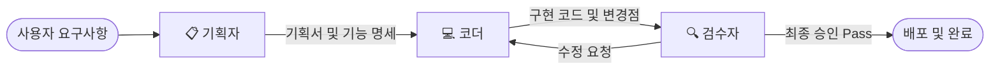

# 🤖 마음 쉼터 프로젝트 멀티 에이전트 오케스트레이션 시스템

이 워크스페이스는 전문화된 세 가지 AI 에이전트(**기획자**, **코더**, **검수자**)가 유기적으로 협업하도록 구성된 멀티 에이전트 개발 환경입니다.

---

## 👥 에이전트 역할 및 책임 (Roles & Responsibilities)

| 에이전트 | 역할 명칭 | 핵심 임무 | 활성화 스킬 / 룰 |
| :--- | :--- | :--- | :--- |
| 📋 **기획자** | `agent-planner` | 요구사항 분석, 시스템 아키텍처 설계, 구현 사양서 및 인터페이스 정의 | `.agents/rules/01_planner.md`<br>`.agents/skills/agent-planner/` |
| 💻 **코더** | `agent-coder` | 기획 사양서 기반 소스 코드 구현, 모듈화, 클린 코드 및 에러 핸들링 | `.agents/rules/02_coder.md`<br>`.agents/skills/agent-coder/` |
| 🔍 **검수자** | `agent-reviewer` | 코드 리뷰, 보안 감사, 요구사항 충족도 점검, 테스트 및 품질 보증(QA) | `.agents/rules/03_reviewer.md`<br>`.agents/skills/agent-reviewer/` |

---

## 🔄 협업 파이프라인 (Collaboration Workflow)



1. **Phase 1: 기획 (Planning)**
   - 사용자의 자연어 요구사항을 바탕으로 `agent-planner`가 아키텍처, 데이터 흐름, 컴포넌트 구조, 인터페이스 명세가 포함된 **기능 기획서**를 수립합니다.
2. **Phase 2: 개발 (Coding)**
   - `agent-coder`는 기획서의 명세를 엄격히 준수하여 버그 없이 깔끔하고 견고한 코드를 작성합니다.
3. **Phase 3: 검수 (Review & QA)**
   - `agent-reviewer`는 기획서 요구사항 충족 여부, 보안 취약점, 엣지 케이스 처리, 코드 품질을 검증하고 피드백 리포트를 발행합니다. 필요시 코더에게 수정을 요청합니다.

---

## 🛠️ 에이전트 호출 및 사용 방법

### 방법 1. Antigravity IDE 대화창에서 역할 호출
대화창에서 특정 역할을 지정하여 작업을 요청할 수 있습니다:
- **기획자 호출**: `"@기획자 관점에서 [새로운 감정 분석 기능]에 대한 기술 기획서와 아키텍처를 작성해줘."`
- **코더 호출**: `"@코더 관점에서 위 기획서의 내용을 바탕으로 server.js와 프론트엔드 코드를 구현해줘."`
- **검수자 호출**: `"@검수자 관점에서 작성된 코드의 보안, 예외 처리, 기획서 반영도를 꼼꼼히 리뷰해줘."`

### 방법 2. 자동화 파이프라인 러너 실행
터미널에서 명령어 한 줄로 3단계 에이전트 체인을 자동 실행할 수 있습니다:
```bash
node .agents/pipeline/multi_agent_runner.js "추가하고자 하는 기능 설명"
```
Gemini 3.8 Flash 모델이 기획 -> 코딩 -> 검수를 연속으로 수행하고 최종 리포트를 출력합니다.
