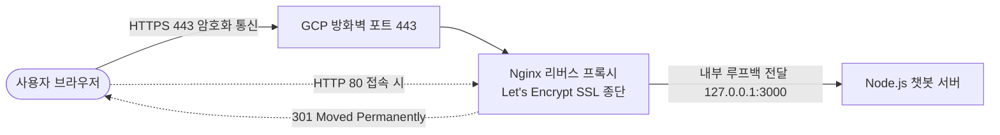
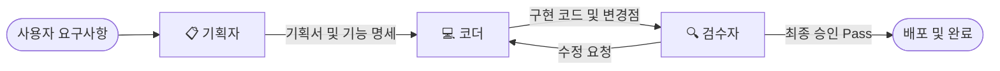

# 🌿 마음 쉼터 (Mind Shelter) - Gemini 3.8 & 3.7 Flash 정신건강 상담 챗봇

> **Gemini 3.8 Flash** 및 **Gemini 3.7 Flash** 기반의 정신건강 심리 상담 특화 웹 챗봇 서비스입니다.  
> 구글 공식 Gemini 웹 인터페이스의 세련된 디자인(오로라 그라데이션, 플로팅 입력바, 다크/라이트 테마, 음성 대화)을 그대로 계승하여 편안하고 따뜻한 상담 경험을 제공합니다.

---

## ✨ 주요 기능

- **🤖 최신 Gemini 모델 지원 및 원클릭 전환**:
  - **Gemini 3.8 Flash (기본)**: 섬세하고 신속한 감정 공감 및 심리적 지지에 특화된 최신 플래시 모델.
  - **Gemini 3.7 Flash (선택)**: 균형 잡힌 대화와 차분한 심신 안정 솔루션 모델.
  - 플로팅 입력바 내부의 모델 셀렉터 배지를 통해 대화 중 언제든 즉시 전환 가능.
- **🌱 전문적인 심리 상담 페르소나**:
  - **무조건적 긍정적 존중 & 감정 수용**: 섣부른 충고나 판단 없이 사용자의 고통과 감정을 먼저 깊이 인정(Validation).
  - **하브루타식 성찰 질문**: 사용자가 자신의 내면을 들여다보고 스스로 마음을 정리할 수 있도록 돕는 개방형 대화.
  - **심신 안정 기법 가이드**: 4-7-8 복식호흡법, 5-4-3-2-1 감각 그라운딩 기법 제공.
- **🚨 24시간 위기 개입 안전 체계**:
  - 자해/자살 징후 감지 시 즉각 위기상담 안내.
  - 상단 내비게이션 및 사이드바에 24시간 위기상담 직통 링크 제공 (자살예방 109, 정신건강 1577-0199, 청소년 1388).
- **🎨 Gemini 스타일의 프리미엄 UI/UX**:
  - Google Gemini 고유의 부드러운 오로라 글래스모피즘 및 감성적인 인터페이스.
  - 시스템 테마 및 사용자 취향에 맞춘 완벽한 **라이트 모드 / 다크 모드** 토글.
  - 실시간 타이핑 효과를 제공하는 **Server-Sent Events(SSE) 스트리밍**.
  - **음성 인식 (STT)** 및 **답변 읽어주기 (TTS)** 내장.
  - 메시지 복사, 추천 주제 칩, 빠른 상담 도구(+) 지원.
- **🔒 안전한 환경변수 보안 구조**:
  - 클라이언트 브라우저에 API 키가 노출되지 않도록 서버사이드 환경변수(`GEMINI_API_KEY`) 기반으로 통신.

---

## 🚀 빠른 시작 (로컬 실행)

### 1. 사전 요구사항
- **Node.js**: v18 이상 권장
- **Gemini API Key**: [Google AI Studio](https://aistudio.google.com/)에서 발급

### 2. 환경변수 설정
시스템 환경변수 또는 프로젝트 루트에 `.env` 파일을 생성하고 키를 입력합니다:

```env
PORT=3000
GEMINI_API_KEY=your_gemini_api_key_here
```

### 3. 패키지 설치 및 서버 구동
```bash
# 의존성 패키지 설치
npm install

# 서버 실행 (기본 포트 3000)
npm start
```

웹 브라우저에서 `http://localhost:3000`으로 접속하여 상담을 시작할 수 있습니다.

---

## ☁️ GCP Compute Engine 배포 가이드

본 프로젝트는 구글 클라우드 플랫폼(GCP)의 Compute Engine VM 인스턴스에 손쉽게 배포할 수 있도록 설계되었습니다.

### 1. Compute Engine VM 인스턴스 생성
1. [Google Cloud Console](https://console.cloud.google.com/)에 접속합니다.
2. **Compute Engine > VM 인스턴스 > 인스턴스 만들기**를 클릭합니다.
   - 머신 유형: `e2-micro` 또는 `e2-small` (저비용 권장)
   - 부팅 디스크: **Ubuntu 22.04 LTS** (기본 10GB~20GB)
   - 방화벽: **HTTP 트래픽 허용**, **HTTPS 트래픽 허용** 체크

### 2. VM 인스턴스 접속 및 환경 설정 (SSH)
VM 인스턴스의 **SSH** 버튼을 눌러 터미널을 엽니다.

```bash
# 1) 패키지 업데이트 및 Node.js 설치
sudo apt update && sudo apt upgrade -y
curl -fsSL https://deb.nodesource.com/setup_20.x | sudo -E bash -
sudo apt install -y nodejs git

# 2) 저장소 복제 (Git Clone)
git clone <YOUR_GIT_REPOSITORY_URL> gcp-compute-engine-chatbot
cd gcp-compute-engine-chatbot

# 3) 패키지 설치
npm install

# 4) 환경변수 설정 (.env 파일 생성)
echo "PORT=80" | sudo tee .env
echo "GEMINI_API_KEY=사용자의_GEMINI_API_키" | sudo tee -a .env
```

### 3. PM2를 활용한 24/7 무중단 백그라운드 실행
```bash
# PM2 프로세스 관리자 전역 설치
sudo npm install -g pm2

# 서버 실행
sudo pm2 start server.js --name "mind-shelter"

# 서버 재부팅 시 자동 실행 등록
sudo pm2 startup
sudo pm2 save
```

### 4. GCP 방화벽 규칙 및 HTTPS 도메인 접속
- 인스턴스 상세 정보의 **외부 IP(External IP)** 주소를 확인합니다.
- **HTTPS 보안 접속 (Let's Encrypt SSL 완벽 적용)**:
  - 👉 **`https://136.65.52.77.sslip.io`**
  - 👉 **`https://136.65.52.77.nip.io`**
- 브라우저에 **초록색 자물쇠(보안 연결)** 가 표시되며, Chrome의 마이크 음성 인식(STT) 기능도 100% 정상 작동합니다.

---

## 🔒 HTTP vs HTTPS 비교 및 SSL 보안 적용 기술

본 프로젝트는 안전하고 신뢰할 수 있는 심리 상담 환경을 위해 일반 HTTP(80)에서 **정식 HTTPS(443) 보안 환경으로 고도화**되었습니다.

### 1. HTTP와 HTTPS의 핵심 차이점

| 비교 항목 | HTTP (HyperText Transfer Protocol) | HTTPS (HTTP over SSL/TLS) |
| :--- | :--- | :--- |
| **기본 포트** | `TCP 80` | `TCP 443` |
| **데이터 암호화** | ❌ **평문(Plaintext) 전송**<br>(네트워크 스니핑 시 상담 대화가 그대로 노출됨) | ✅ **TLS 1.3 양방향 암호화**<br>(데이터 전송 구간 완벽 암호화 및 무결성 보장) |
| **브라우저 표시** | ⚠️ `Not secure (주의 요함)` 경고 표시 | 🔒 `보안 연결 (자물쇠 아이콘)` 표시 |
| **웹 표준 하드웨어 권한** | ❌ **마이크/카메라 접근 차단**<br>(Chrome 보안 정책상 비보안 출처의 마이크 접근 금지) | ✅ **마이크 음성 인식(STT) 정상 허용**<br>(Web Speech API 안전한 컨텍스트 충족) |
| **데이터 위변조 방지** | 중간자 공격(MITM)에 취약 | 인증서 서명 검증을 통해 패킷 변조 원천 차단 |

---

### 2. HTTPS 전환을 위해 적용된 기술 아키텍처



#### 🌐 1) 동적 와일드카드 DNS (Dynamic Wildcard DNS - `sslip.io` / `nip.io`)
- **도입 이유**: SSL/TLS 공인 인증서는 숫자 IP(`136.65.52.77`)에 직접 무료 발급되지 않고 공인 도메인 이름(FQDN)을 필요로 합니다.
- **적용 기술**: 도메인을 별도로 구매하지 않고도 IP를 도메인화해 주는 와일드카드 DNS 기술을 적용하여 `136.65.52.77.sslip.io` 및 `136.65.52.77.nip.io`를 인스턴스 공인 IP로 즉시 해석하도록 구성하였습니다.

#### 🛡️ 2) GCP VPC 방화벽 (Firewall Rule)
- `gcloud compute firewall-rules update`를 통해 `allow-chatbot-web` 규칙에 `tcp:443`을 추가하여 전 세계 인터넷(`0.0.0.0/0`)의 인바운드 HTTPS 트래픽을 허용하였습니다.

#### ⚡ 3) Nginx 고성능 리버스 프록시 (Reverse Proxy)
- 외부 포트 80과 443을 Nginx가 전담 수신하고, 내부 Node.js 앱(`127.0.0.1:3000`)으로 안전하게 중계하도록 분리하였습니다.
- **실시간 SSE 스트리밍 최적화**: Gemini AI의 실시간 답변 타이핑이 지연 없이 흘러나올 수 있도록 `proxy_buffering off;` 및 `proxy_read_timeout 86400s;`를 적용하였습니다.

#### 📜 4) Let's Encrypt & Certbot (자동화된 공인 인증서 체계)
- 글로벌 비영리 인증 기관인 **Let's Encrypt**로부터 ACME 프로토콜을 이용해 무료 정식 SSL 인증서를 발급받았습니다.
- `certbot.timer` 시스템 데몬을 활성화하여 90일 주기의 인증서 갱신을 사람의 개입 없이 24/7 자동 갱신하도록 구성하였습니다.

#### 🔄 5) HTTP to HTTPS 강제 리다이렉션 (301 Redirect)
- 사용자가 실수로 `http://`로 접속하더라도 Nginx 단에서 자동으로 안전한 `https://`로 영구 리다이렉션(`301 Moved Permanently`)되도록 설계하여 보안성을 극대화하였습니다.

---

## 🤖 멀티 에이전트 시스템 (.agents)

본 프로젝트는 전문화된 세 AI 에이전트(**기획자**, **코더**, **검수자**)가 유기적으로 협업하는 **멀티 에이전트 개발 환경**을 갖추고 있습니다.



### 1. 역할 정의
- 📋 **기획자 (`agent-planner`)**: 요구사항 분석, 시스템 아키텍처 및 인터페이스 설계, WBS 도출
- 💻 **코더 (`agent-coder`)**: 기획 사양서 기반 소스 코드 구현, 모듈화, 클린 코드 및 방어적 예외 처리
- 🔍 **검수자 (`agent-reviewer`)**: 코드 리뷰, 보안 감사, 요구사항 충족도 점검, 최종 PASS/FAIL 판정

### 2. 사용 방법

#### 방법 A. Antigravity IDE 대화창에서 역할 호출
- `"@기획자 관점에서 상담 예약 기능에 대한 아키텍처와 기획서를 작성해줘."`
- `"@코더 관점에서 위 기획서를 바탕으로 소스 코드를 구현해줘."`
- `"@검수자 관점에서 작성된 코드의 보안 및 에러 처리를 철저히 리뷰해줘."`

#### 방법 B. 자동화 파이프라인 CLI 실행
터미널에서 명령어 한 줄로 3단계 에이전트 협업 체인을 자동 실행할 수 있습니다:
```bash
npm run agents "추가하고 싶은 기능 설명"
# 또는
node .agents/pipeline/multi_agent_runner.js "추가하고 싶은 기능 설명"
```
실행이 완료되면 `.agents/pipeline/latest_multi_agent_report.md` 파일에 기획서, 구현 코드, 검수자 판정 리포트가 자동으로 기록됩니다.

---

## 📁 프로젝트 구조

```
gcp-compute-engine-chatbot/
├── .agents/                      # 멀티 에이전트 워크스페이스 루트
│   ├── AGENTS.md                 # 멀티 에이전트 총괄 규칙 및 워크플로우
│   ├── rules/                    # 에이전트별 행동 규칙 (기획자, 코더, 검수자)
│   ├── skills/                   # 에이전트별 전문 스킬 (SKILL.md)
│   └── pipeline/                 # 자동 협동 파이프라인 러너 (multi_agent_runner.js)
├── package.json                  # 프로젝트 의존성 및 스크립트 정의
├── server.js                     # Express 서버 (Gemini API SSE 스트리밍 & 보안 처리)
├── README.md                     # 프로젝트 소개 및 배포 가이드
└── public/
    ├── index.html                # Gemini 모티브 웹 UI 구조
    ├── css/
    │   └── style.css             # 오로라 그라데이션, 다크모드, 플로팅 입력바 스타일
    └── js/
        └── app.js                # 모델 전환, 스트리밍 수신, STT/TTS, 마크다운 렌더링
```

---

## ⚠️ 안내 및 주의사항
- 본 서비스는 인공지능 기반의 심리 지원 및 자조(Self-help) 보조 도구이며, 정신과 전문의의 의학적 진단 및 치료를 대체할 수 없습니다.
- 신체적 위험이나 긴급한 심리적 위기 상황에 처한 경우 즉시 **109 (자살예방상담전화)** 또는 **1577-0199 (정신건강위기상담전화)**로 연락하여 전문가의 도움을 받으시기 바랍니다.
